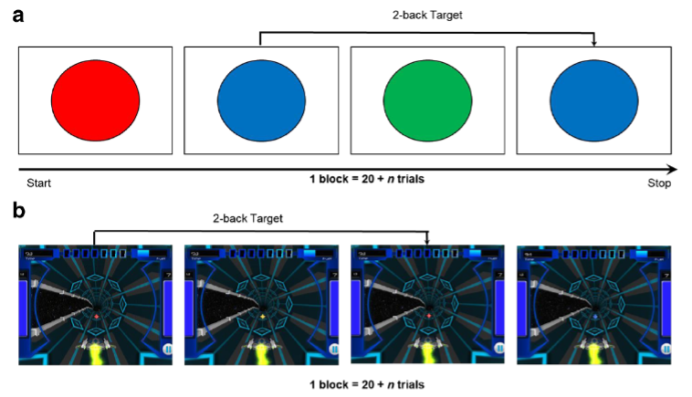
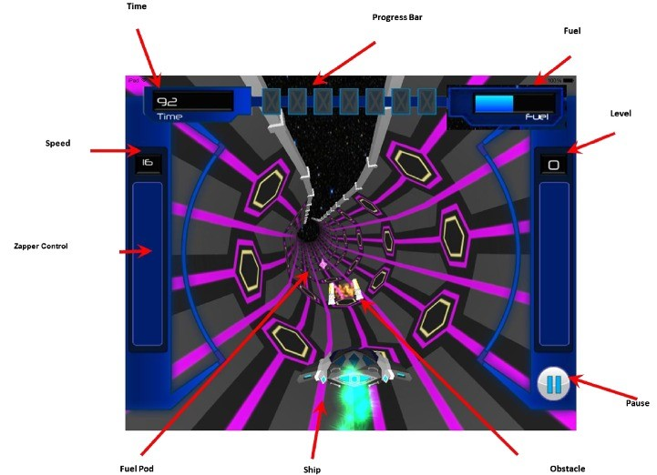

[comment]: # (ATTENTION: This is a template. You can adapt and expand it as you like and serves as a solid starting point.)
[comment]: # (Be aware that most of the code is provided via 'html' and 'css' format.)
[comment]: # (To make comments like this, you can simply copy one of these lines and change everything between the parentheses.)
[comment]: # (Before starting, first read carefully all comments and try to get familiar with the template.)

[comment]: # (Tool recommendation: Visual Studio Code - https://code.visualstudio.com/)
[comment]: # (This is just a personal recommendation because VS Code is free, easy to use and offers a lot of useful extensions.)
[comment]: # (VS Code offers a extention which allows you to preview your document within the Code Editor - which is very useful.)
[comment]: # (Extension recommendation: Markdown All in One --> helpfull commands and options)
[comment]: # (Extension recommendation: Markdown Preview Enhanced --> allows to preview page within VS Code)
[comment]: # (Extension recommendation: Markdown PDF --> allows to export Markdown to pdf, html, png, jpeg)

[comment]: # (To convert the markdown file to html with 'Markdown PDF' [1] open in VS Code the preview, [2] right click into the window with the preview, [3] Click on HTML --> HTML cdn hosted. --> Do NOT right click and export where your code is, since it will be without the format)

[comment]: # (When you are done, upload your work and use GitHub Pages to create your own website.)
[comment]: # (In the folder 'github_pages_tutorial' you can find pictures for the instructions. Be sure that the exported .html file is name 'index.html')
[comment]: # (Additionally the link to the official instruction: https://pages.github.com/)

[comment]: # (In this section you can define rules for special blocks or formats.)

[comment]: # (Here starts the section where you are intented to insert your work.)
<body>

[comment]: # (Title)
<h1> The Effects of Gamification on Computerized Cognitive Training: Systematic Review and Meta-Analysis (Vermeir et al., 2020) </h1>

[comment]: # (Header of a section with a horizontal line)

  VERY BRIEF META-ANALYSIS
  
 

[comment]: # (Text Box of a section)

<b>Focus of the study</b>  
Gamification of computerized cognitive training

<b>Target group</b>  
Individuals with interest in (gamified) cognitive training of different age groups

<b>Average effect size</b>  
Positive effect of gamification on cognitive training tasks regarding motivation/engagement (g = 0.72), negative effect regarding task demand/difficulty (g = -0.52); no effect regarding training domain, including cognitive process and clinical outcomes

<b>Additional remarks/results</b>  
Further studies needed due to the low number of studies for individual outcomes (e.g., demand/difficulty, flow/immersion, feasibility)

[comment]: # (Little hack to insert space between the current and next element)

[comment]: # (Box and Button to download the pdf. change example.pdf to the real name when you are finished. e.g. short-review-lastname-firstname.pdf)

 
<a href="gamification_on_computerized_cognitive_training.pdf">
<button class="downloadbutton"> <b>Download PDF</b></button>
</a>

[comment]: # (Little hack to insert space between the current and next element)

[comment]: # (Header of a section with a horizontal line)

  SHORT-REVIEW OF META-ANALYSIS
  
 

[comment]: # (Text Box of a section)

<b>Introduction</b>

The interest in gamification, “the use of digital game elements (e.g., points, avatars) in nonentertainment settings” (Vermeir et al., 2020, p. 2), in various domains is steadily increasing due to its motivating and engaging effects (Lumsden et al., 2016). Even if this is not always easy in practice, gamification is to be distinguished from serious games which "employ full-fledged games within nongame contexts" (Vermeir et al., p. 2). The use of digital technologies is on the rise and so is the use of digital interventions, for instance, smartphones offer new opportunities for the application of gamification in the health sector (Johnson et al., 2016). 

 The authors defined cognitive training as "training of mental processes involving attention (e.g., selective attention), memory (e.g., working memory), executive functioning (e.g., planning, inhibition, mental flexibility), decision making, processing speed, and perception (including visual, auditory, and tactile perception)" (Vermeir et al., 2020, p. 3). Since computerized cognitive training consists of systematic practice of the appropriate tasks aimed at enhancing cognitive functions, and this training usually involves several similar, monotonous sessions, gamification is of great interest to counteract potential disengagement and high dropout rates (Harvey et al., 2018, Katz et al., 2014, cited in Vermeir et al.) and to subsequently increase participation in practice. According to the self-determination theory, motivation goes from intrinsic motivation through extrinsic motivation to amotivation, the first being crucial for long-term engagement and the second for short-term engagement (Deci & Ryan, 1985, Ryan & Deci, 2000, cited in Vermeir et al.). By integrating game elements such as badges, levels, points, or avatars (Lumsden et al., 2016), both types, intrinsic and extrinsic motivation, are combined (Muntean, 2011, cited in Vermeir et al.). With their systematic review of the state-of-the-art as well as their meta-analysis of the effectiveness of gamified cognitive training, Vermeir and colleagues aimed to provide valuable insights for future studies as well as for the practical development of digital technologies and interventions. 

[comment]: # (Hack for space and horizontal line)

 

[comment]: # (Text Box of a section)

<b>What is this study about?</b>

The systematic review and meta-analysis by Vermeir et al. (2020) focus on gamification of computerized cognitive training. The systematic review covers population types and age groups, cognitive domains, different applications of gamification, e.g., in terms of game element types, as well as the methodological quality of the included studies. The meta-analysis establishes the impact of gamification on process outcomes (i.e., motivation, engagement, flow, immersion, demand, difficulty, and feasibility), on changes in the training domain (i.e., cognitive process and clinical outcomes), and investigates potential moderators (Vermeir et al.). 

 The search for appropriate studies was conducted in the following databases: PsycINFO, CINAHL, ProQuest Psychology, Web of Science, Scopus, PubMed, Science Direct, EMBASE, IEEE Xplore, ACM, and gray literature databases. Search terms such as gamification, cognition and training were used, as well as variations thereof (e.g., game element*, gamif*, cognit*, mental process*, train*, intervention*). In addition, a manual search was performed. Inclusion criteria of the systematic review were the following. The study had to be original empirical research on gamification, gamification literature or the use of game elements as well as peer-reviewed and the full text had to be available and in English. Furthermore, the task of the study had to be the training or modification of cognition, in this at least one game element had to be implemented and it had to be done via digital device. The studies had to examine at least one outcome from the areas of process and changes in the training domain using subjective and/or objective methods. Not included were studies about persuasive games, serious games, or full-fledged games. In order to ensure a minimum quality level for the meta-analysis, there were two additional criteria. Selected studies had to report the effect of at minimum two cognitive trainings, which were very similar apart from the integration of gamification and had to be a randomized controlled trial with two different groups attending the training. Finally, after at least two authors agreed for reliability reasons, 47 of the initial 1069 different records found, reporting on 49 individual studies, were included in the systematic review, and of these, 9 records from 9 individual studies were eligible for the meta-analysis (Vermeir et al., 2020).  

[comment]: # (Hack for space and horizontal line)

 

[comment]: # (Text Box of a section)

<b>What are the results of the study?</b>

<i>Results of systematic review</i> 

Calculations using the Comprehensive Meta-Analysis software (CMA, Biostat Inc.) showed that of the 49 mostly European studies in the systematic review, 78 % were published as academic journal articles, 18 % as conference papers, and the remainder as doctoral theses, all between 2008 and 2017, whereby 94 % after 2010. Of the total 4003 participants, the mean age was between 9 and 83 years, which shows the diversity of the application of gamification. 88 % of all studies included both men and women, and 78 % included adults. The sample of 15 studies was classified as low-risk, for instance including university students or schoolchildren, that of 33 studies as high-risk, including elderly drivers, children with autism spectrum disorder, etc., and one sample included both. Most studies used a between-subject design and dealt with only one cognitive domain, most frequently attention and working memory. Among the outcome measures were questionnaires, semistructured interviews, or video-recorded observations. The number of sessions also varied, from 1 to a maximum of 59, follow-up assessments were available in only 14 studies, and the most common locations were at a research site, for instance, laboratory, hospital, school or university, and the subject’s home. The most common devices used were computers and tablets (Vermeir et al., 2020). 

 Regarding game elements, it can be said that each of the 49 studies implemented between 2 and 9 different elements, the most common being five different ones. The most frequently chosen elements were rewards like points or badges, feedback loops, story/theme, difficulty adjustment, but also game level, progress, and challenge. Except for story/theme, which is immersion-oriented, the others mentioned are classified as achievement and progression-oriented. Social-oriented game elements, on the other hand, were very rarely used. It should also be mentioned that in the implementation of these, existing theories and principles (e.g., self-determination theory) were used in only 17 studies. None of the 49 studies, with the exception of Mohammed et al. (2017), met all quality criteria what was assessed with a self-designed tool. With regard to external validity, more than 80 % of the studies adequately described the setting or location and the gamified task. Regarding internal validity, about 80 % had inadequate or unclear blinding of the personnel as well as of the participants and a control comparison condition was missing (Vermeir et al., 2020). 

<i>Results of meta-analysis</i> 

The meta-analysis dealing with outcomes concerning motivation and engagement involved eight studies which included 295 subjects with gamified tasks and 219 subjects with non- or less-gamified tasks. A significant moderate positive effect of the implementation of game elements on motivation and engagement can be reported (Hedges g = 0.72, 95 % CI 0.26 to 1.19, P = .002), whereby gamified training tasks were seen as more motivating/engaging than non- or less-gamified ones. The analysis about the gamification effect on outcomes concerning demand and difficulty including three independent studies showed a significant moderate negative effect (Hedges g = -0.52, 95 % CI 0.89 to 0.14, P = .007), indicating that gamified tasks were seen as more demanding/difficult than the control tasks. The meta-analysis about flow and immersion-related outcomes including two studies found no significant gamification effect (Hedges g = 0.10, 95 % CI 0.36 to 0.55, P = .68). The effect on feasibility was examined in only one study and was also not significant (Hedges g = 0.36, 95 % CI 0.97 to 0.26, P = .25; Vermeir et al., 2020).

The meta-analyses about the training domain found no significant effects. The one about cognitive process outcomes involved nine studies which included 301 subjects with gamified tasks and 229 subjects with non- or less-gamified tasks. The analysis reported a not significant small positive effect (Hedges g = 0.27, 95 % CI 0.08 to 0.62, P = .14). The analysis of four studies dealing with the gamification effect on clinical outcomes also found no significant effect (Hedges g = 0.07, 95 % CI 0.19 to 0.32, P = .61; Vermeir et al., 2020). 

[comment]: # (Hack for space and horizontal line)

 

[comment]: # (Text Box of a section)

<b>Quality of the meta-analysis</b>

The following is an evaluation of the study quality using Abelson's (1995) five MAGIC criteria.

 <i>Magnitude – How substantial is the outcome?</i> 

According to the common classification of Cohen (1988), gamification showed a moderate positive effect on motivation and engagement (Hedges g = 0.72) in cognitive training, and a moderate negative effect on demand and difficulty (Hedges g = -0.52) of the training tasks. A gamification effect on the training domain, including cognitive process and clinical outcomes, could not be found. Since no comparable meta-analysis is known to date, the magnitude of the effects can only be compared with future meta-analyses. However, the positive effect of gamification on motivation and engagement found at least confirmed the results of the systematic review by Lumsden et al. (2016). The negative effect found on demand/difficulty must be viewed critically due to the small number of studies.

<i>Articulation – How specific/precise is the outcome?</i>

The effect sizes were presented individually for all outcomes considered, whereby engagement and motivation as well as demand and difficulty were examined together due to their high degree of relatedness. Furthermore, analyses for individual subgroups were also calculated for outcomes in which there were indications of differences, but these were not confirmed (see Generality). The results can thus be seen as very precisely presented.

<i>Generality – Is the outcome generalizable?</i>

Due to the complex study selection procedure including the manual research as well as the inclusion of grey literature, the study searched for suitable studies on a very broad basis which speaks for generalizable results, as well as the large age range, even if studies with adults were predominantly included. However, due to the small number of studies and sample sizes for individual outcomes, further research is needed, since an effect over only three studies involving 136 subjects in total, as is the case with the outcome demand/difficulty, must be viewed critically. Due to the observed heterogeneity for the outcomes motivation/engagement and cognitive process, subgroup analyses were calculated to identify potential moderators. However, the effects proved to be very robust, because there were no differences in the different age groups or in the population types. Because of too few studies within subgroups, the analyses for cognitive domain and game elements type were not possible. Since some game elements are integrated more often than others, the generalizability of the effects to less frequently used elements (e.g., social-oriented game elements) cannot be guaranteed. Meta-regression analyses showed no significant relationship for the effect sizes and the number of game elements as well as the number of training sessions for the outcomes motivation/engagement and cognitive process. In this respect, the effects can thus be estimated as generalizable. Since most of the studies were conducted in the European cultural area, the meta-analysis does not show whether the effects can be generalized across cultural contexts. In conclusion, it can be said that the authors' thoughtful, accurate work also did nothing to change the fact that too few studies of good methodological quality are available and so the generalizability of the findings is limited. 

<i>Interestingness – How relevant is the outcome?</i>

Since gamification still needs further examination in terms of effectiveness due to its novelty and since no meta-analysis for cognitive training is yet known in this regard (Vermeir et al., 2020), the selected meta-analysis and its results are of high relevance for science as well as for practice. Although the systematic review by Lumsden et al. (2016) showed how cognitive assessment and training was gamified in 33 studies, the quality of the studies was not inspected. The present study showed that further studies are needed in this area and provided valuable insights for future developers of such computerized cognitive trainings. The finding that gamification increases motivation and engagement in cognitive training is of great importance for practice, especially in clinical settings, not only for interventions but also for prevention of cognitive decline. 

<i>Credibility – How methodologically credible is the outcome?</i>

The presentation of the methodological approach corresponds to the PRISMA guidelines (Moher et al., 2009, cited in Vermeir et al., 2020), a detailed description of the methods is presented. The study was also PROSPERO preregistered. Using a random-effects model, the effect sizes of different studies were pooled, whereby posttraining data and not change scores were used to reduce risk of bias (Vermeir et al.). Further, Hedges g was used because it is robust to small samples (Hedges & Olkin, 1985, cited in Vermeir et al.). All studies were peer-review and randomized controlled trials and decisions were always made by two authors independently of each other. The degree of heterogeneity in effect sizes was tested with the Cochran Q test (Borenstein et al., 2009, cited in Vermeir et al.). The significant results of the leave-one-out sensitivity analysis for the demand/difficulty outcome, which can be interpreted that the results were biased by one study, could be explained by the low statistical power (Vermeir et al.). Further, none of the outcomes showed evidence of publication bias, which was tested visual by inspecting the funnel plots and with the Egger regression test (Egger et al., 1997, cited in Vermeir et al.), with the exception of clinical outcomes. For these outcomes the funnel plot was asymmetric and the egger test significant, but further analyses in which two studies were trimmed did not change the effect. The quality was assessed with the Cochrane risk of bias tool (Higgins, Altman, & Sterne, 2011, as cited in Vermeir et al.). To ensure minimal quality, additional inclusion criteria were defined for the meta-analysis, however, the risk of bias assessment showed that the methodological quality was not ideal, most frequent was the risk of inadequate blinding of subjects, personnel, and outcome assessment (Vermeir et al.). All in all, the results of the meta-analysis are mostly methodologically credible due to the pros mentioned, even if the cons mentioned should not be disregarded.

[comment]: # (Hack for space and horizontal line)

 

[comment]: # (Text Box of a section)

<b>Conclusion</b>

The fact that 40 of the 49 studies in the systematic review could not be included in the meta-analysis for quality reasons confirmed that this field of research is still developing and that there is a lack of well-controlled empirical studies, which in turn offers opportunities for future research. The study found that the training tasks that were gamified were seen as more motivating/engaging and more demanding/difficult than non-gamified or less gamified ones. A possible explanation for the latter could be that gamification makes the task more complex due to the added game elements (Lopez & Tucker, 2017, cited in Vermeir et al., 2020). No significant effects were found with regard to the other outcomes studied, nor were any moderator variables found in general. Nevertheless, the small number of studies should not be ignored. Previous reviews reported mixed evidence for the effect of gamification on cognitive outcomes (Lumsden et al., 2016, Johnson et al., 2016). According to the explanation by Nicholson (2015, cited in Vermeir et al.), an effect not found like in this meta-analysis could be explained by the fact that gamification was not successfully implemented in the task. Because of the complexity, the integration of gamification needs to be well thought out. It is also possible that due to the small number of studies, an existing effect of gamification on cognitive outcomes was not detected (Vermeir et al.). Furthermore, cognitive outcomes were not predicted by the number of sessions, what can be explained by the fact that subjects first have to get familiar with the gamified setting (Vermeir et al.). The research should also be concerned with providing a clear classification as to when one should no longer speak of gamification but of a game (Lumsden et al., 2016, Johnson et al., 2016), and guidelines for evaluating the gamification quality. More theory-driven studies are needed, especially with children and adolescents and which evaluate long-term effects. As the meta-analysis also showed, there is a large research gap regarding the use of smartphones as a device, the evaluation of the effects of individual game elements as well as the perception towards gamification in general (Vermeir et al.). 

 Due to the motivating/engaging effect of gamification on computerized cognitive training, the use of gamification in practice can be recommended. Therefore, the development of validated trainings where game elements are properly applied is required. The moderator analyses for motivation/engagement and cognitive process did not provide explanations for the significant heterogeneity, but these results support the assumption that gamification can be applied to different age groups and population types, i.e., to a wide range of individuals (Vermeir et al., 2020). However, gamified tasks should not be developed for the general public but for the specific target group or there should be adaptation options like different themes for young boys and girls, because not everyone reacts to the same game element in the same way (Kappen et al., 2017, Codish & Ravid, 2014, Böckle et al., 2017, cited in Vermeir et al.). This should be considered especially for the application of gamification in the clinical context, because so it would be easier for clinical staff to use such trainings. Future cognitive trainings should also have implemented less frequently used game elements such as social-oriented ones, as the most commonly used rewards are criticized for not providing long-term effects because they are purely extrinsically motivating. Immersion-related elements can fulfill autonomy needs in terms of self determination theory and so they can be intrinsically motivating (Boendermaker et al., 2015, Ryan & Deci, 2000, Nicholson, 2015, Deci & Ryan, 1985, cited in Vermeir et al.) and therefore the use is also suggested to increase the cognitive training benefits in practice. 

  STUDY EXAMPLE
  
 

[comment]: # (Text Box of a section)

<b>The Benefits and Challenges of Implementing Motivational Features to Boost Cognitive Training Outcome (Mohammed et al., 2017)</b>

<i>What was done?</i>

 The study by Mohammed et al. (2017) aimed to provide new insights into the so far inconsistent findings of the effects of gamification on learning. Working memory is critical for learning and day-to-day functioning, and N-back tasks showed promise for training working memory. Therefore, the authors decided to implement motivational features in a cognitive training that uses N-back tasks to increase engagement and motivation. The study was conducted at two universities in southern California with a total of 115 participants (age in years: M = 20.02, SD = 1.96; 67.7 % women) in the laboratory over a period of four weeks during which 20 sessions of N-back training were provided (Mohammed et al.). 

For 47 randomly assigned subjects, the task of each 20-min training session was to complete a basic color/identity N-back task (see point a of Figure 1). The other 68 subjects were concerned with the gamified version, an engaging 3D space-themed "collection" game (“Recall the Game”, Deveau et al., 2015) that includes the basic mechanics of the N-back task (see point b of Figure 1). The task of the game was to navigate an alien’s ship through wormholes and escape from a hostile alien planet. The N-back stimuli (see “Fuel Pod” in Figure 2) had to be perceived and obstacles had to be avoided. In N-back tasks, the goal is for the subject to decide whether the current stimulus is the same stimulus as the one presented N-items before. Participants should tap the tablet screen to do this in both training versions. For example, Figure 1 illustrates a 2-back task in both variants. Using a similar adaptive algorithm, the difficulty of the level could be adjusted for both trainings based on the participant’s performance. In both variants, the maximum N-level reached per session was the dependent variable. Each training session was also followed by two questions to assess the experienced enjoyment and effort (Mohammed et al., 2017). 

In addition to testing whether gamification of an N-back task has a positive effect on learning compared to the non-gamified version, it was also tested whether a positive effect on learning transfer can be observed. To assess near transfer, the pre- and post-test assessments included the Object N-Back Task (Jaeggi et al., 2010, Au et al., 2016, cited in Mohammed et al., 2017), which uses pictures of animals as stimuli. In order to assess the far transfer, different measures of inhibitory control and interference resolution, which share common variance with the N-back task (Hsu et al., 2017, Szmalec et al., 2011, cited in Mohammed et al.), were also included. The authors expected more engagement and enjoyment to be reported in the gamified group and an equal or greater learning gain to be observed in terms of learning benefits and learning transfer compared to the non-gamified group (Mohammed et al.).

<b>Figure 1</b> 	 
<i>Non-gamified Tapback condition is shown under point a; gamified Recall condition is shown under point b; in both cases, a 2-back task is presented (picture taken from Mohammed et al., 2017)</i>

 <b>Figure 2</b> 
<i>Screenshot from the Recall game, which shows the elements to be monitored, including the target N-back element “Fuel Pod” (picture taken from Mohammed et al., 2017)</i>

 

 <i>What were the main results?</i>

There were no baseline differences between the two groups (all p > 0.2), except that the non-gamified group was significantly faster in its response in the non-trained 2-back (t(113) = 2.97, p = 0.004) and 3-back task (t(113) = 2.51, p = 0.013) than the gamified group. Furthermore, there was no significant difference in the number of sessions completed (p = 0.89). Of the 20 possible sessions, both groups completed on average 19 (Mohammed et al., 2017).

Regarding training performance, there was a significant improvement in both groups. In the gamified group, the average N-back level increased from 3.28 (SD = 1.23, first two sessions) to 4.60 (SD = 1.12, last two sessions; p < 0.01, d = 1.128). In the non-gamified group, the average N-back level increased from 3.38 (SD = 1.22) to 4.03 (SD = 1.08; p < 0.01; d = 0.67). The gamified group improved more than the non-gamified group during training (p < 0.001, d = 0.76), but the training curves showed that this effect only appeared after session 4. Further analysis revealed that participants in the gamified group rated the self-perceived enjoyment of the task higher than the non-gamified group (F(1,113) = 5.27, p = 0.023, ηp2 = 0.50), as did the effort expended (F(1,113) = 3.93, p = 0.05, ηp2 = 0.22). The correlations of enjoyment and effort with training gains showed no significant results (all p > 0.2), except that enjoyment in the non-gamified group correlated positively with training gains (r(39) = 0.26, p = 0.04), which can be interpreted as those who enjoyed the training more, also improved more (Mohammed et al., 2017). 

ANCOVAs regarding near learning transfer, in which the two groups were compared and the N-back performance of the pre-test served as covariate and that of the post-test as outcome variable, showed no significant effects (all p > 0.2), except for the 2-back reaction time (F(2,113) = 3.19, p = 0.04, ηp2 = 0.18). Further, it was expected that the gamified group would outperform the non-gamified group, but the results of the analyses regarding far training transfer showed no significant group differences (all p > 0.3; Mohammed et al., 2017).

<i>Conclusion</i>

In summary, both groups benefited significantly from the N-back training. Furthermore, it was shown that the gamified group improved significantly more in their training task than the non-gamified group. These improvements were especially evident after session 4, which suggests that gamification may not be beneficial in shorter interventions (Mohammed et al., 2017), as participants need to get used to the setting and the game elements added may be non-beneficial at first, or even counterproductive (Katz et al., 2014, cited in Mohammed et al.). The latter did not show up in this study, possibly due to the young sample or the appropriate game design which was complex and carefully constructed to promote learning. Gamification of computerized cognitive training, as is the case here, can thus properly applied enhance training effects according to the results of the study. A possible explanation is the as expected results which showed that gamification of the N-back task leads to higher enjoyment and effort. The positive correlation of enjoyment and training gain in the non-gamified group suggests that for intrinsically motivated individuals gamification may be not necessary to learn. Since this correlation was not found in the gamified group, gamification can also be seen as a means to bridge these individual differences and make better learning possible for all (Mohammed et al.).

Besides the differences mentioned above, the implementation of the game elements did not lead to differences in the outcome measures, with the exception of the 2-back reaction time, although this difference is probably due to the regression to the mean phenomenon. Contrary to expectations, the results did not prove that gamification leads to better learning in general and a greater far learning transfer, despite the elaborate design and the rather large sample size. An explanation for the lack of greater learning transfer could be the possibly added distractions, such as the crowded screen (see Figure 2), different sounds, and the general piloting task. It is possible that the desired boost effect of learning transfer would have been achieved if the outcome measures had also included gamification, since the gamified group was trained in this respect (Mohammed et al., 2017).

Future studies should continue to work on developing a game that, in addition to the enjoyment and effort, also increases the transfer of learning and offers the opportunity to find out what influence the individual game elements have and to be easily adapted to individual differences of the participants. Furthermore, it should be looked at how many training sessions are optimal, because contrary to previous findings, ceiling effects in training performance occurred after six sessions. In conclusion, it can be said that gamification represents a good chance that, properly applied, cognitive training will become more popular in practice and benefit society as a result (Mohammed et al., 2017).

<i>Why is it special to me?</i>

The study is special to me because it deals with exactly what I am interested in, especially with regard to my master thesis, which also deals with gamification of cognitive tasks, in my case the assessment of executive functions which also includes an N-back task. As in this study I am also interested in motivational, emotional and performance effects through the implementation of game elements. Through all the different outcome measures that were included in the study, I also received suggestions as to which measures I could include as an external criterion in my study design. All in all, I really enjoyed the work of Mohammed et al. (2017), the paper was very easy to understand and I was able to take away and learn a lot, not only because of the high methodological quality of the study. The results also generated many suggestions for future studies.

<i>Why is it a good example to me?</i>

The study shines with a very good methodological quality, as it is the only one of the studies included in the meta-analysis that fulfills all relevant criteria of their self-designed tool regarding external and internal validity. The authors have shared all the necessary information to perform the risk of bias assessment using the Cochrane tool. Except for the high risk regarding allocation concealment, a low risk for bias assessment was shown (Vermeir et al., 2020). These points speak that the study is a good example to the meta-analysis presented above, as good, proper work should be used as an example regardless of the results found, especially because the results of the meta-analysis are limited due to the overall not ideal quality.

The selected study is also a good example in terms of content, because the types of elements which have been integrated into the game, are, according to meta-analysis, also the most commonly used (e.g., rewards, feedback, difficulty adjustments, game level, progress, challenge, story, sound effects). The results of the study with regard to higher enjoyment and effort in the gamified task also reflect the results of the meta-analysis. In the meta-analysis, no effect of gamification on process outcomes was found, but Mohammed et al. (2017) showed that gamification can indeed mean higher training benefits. In contrast to other studies, with 20 sessions offered, one can undoubtedly speak of training in this study and also the game design was elaborately and carefully created, which, as the results showed, is extremely important in order to implement game elements that are beneficial for learning. The importance of pre- and post-tests was also emphasized because the stronger training effects found in the gamified condition did not affect the transfer of learning which is actually desired in practice. The study shows how difficult it is to integrate gamification properly and the partly inconsistent results to previous studies emphasize the importance of further research in this area. 

[comment]: # (Hack for space and horizontal line)

 

[comment]: # (Text Box of a section)

<b>References</b>

Abelson, R. P. (1995). <i>Statistics as principled argument.</i> Hillsdale, NJ: Lawrence Erlbaum Associates.

 Cohen, J. (1988). <i>Statistical power analysis for the behavioral sciences</i> (2. Auflage). Hillsdale, NJ: Erlbaum. 

Deveau, J., Jaeggi, S. M., Zordan, V., Phung, C., & Seitz, A. R. (2015). How to build better memory training games. <i>Frontiers in systems neuroscience</i>, <i>8</i>, 243. <a href="https://doi.org/10.3389/fnsys.2014.00243">https://doi.org/10.3389/fnsys.2014.00243</a>

Johnson, D., Deterding, S., Kuhn, K. A., Staneva, A., Stoyanov, S., & Hides, L. (2016). Gamification for health and wellbeing: A systematic review of the literature. <i>Internet Interventions</i>, <i>6</i>, 89-106. <a href="http://dx.doi.org/10.1016/j.invent.2016.10.002">http://dx.doi.org/10.1016/j.invent.2016.10.002</a>

<b>Mohammed, S., Flores, L., Deveau, J., Cohen Hoffing, R., Phung, C., M Parlett, C., ... & Seitz, A. R. (2017). The benefits and challenges of implementing motivational features to boost cognitive training outcome. <i>Journal of Cognitive Enhancement</i>, <i>1</i>, 491-507. <a href="https://doi.org/10.1007/s41465-017-0047-y">https://doi.org/10.1007/s41465-017-0047-y</a></b>

Lumsden, J., Edwards, E. A., Lawrence, N. S., Coyle, D., & Munafò, M. R. (2016). Gamification of cognitive assessment and cognitive training: a systematic review of applications and efficacy. <i>JMIR serious games</i>, <i>4</i>(2), e5888. <a href="https://doi.org/10.2196/games.5888">https://doi.org/10.2196/games.5888</a>

<b>Vermeir, J. F., White, M. J., Johnson, D., Crombez, G., & Van Ryckeghem, D. M. (2020). The effects of gamification on computerized cognitive training: systematic review and meta-analysis. <i>JMIR serious games</i>, <i>8</i>(3), e18644. <a href="https://doi.org/10.2196/18644">https://doi.org/10.2196/18644</a></b>

</body> 
